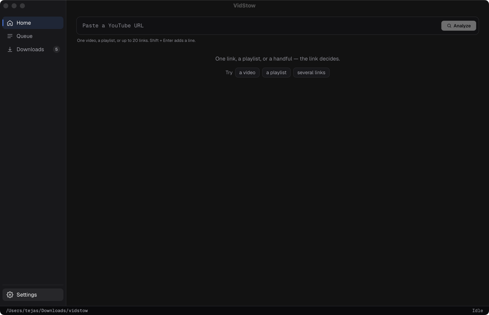
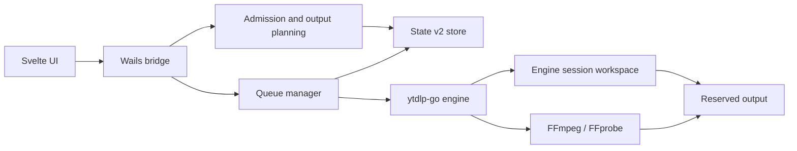

<div align="center">


# VidStow

### Download public YouTube videos with a focused desktop queue.

A local desktop application built with Go, Wails, and Svelte.

[](#project-status)
[](LICENSE)
[](go.mod)
[](https://wails.io/)
[](frontend/package.json)
[](go.mod)

[Download](#download) · [Features](#features) · [Screenshots](#screenshots) · [Project status](#project-status) · [Run locally](#run-locally) · [How it works](#how-it-works) · [Contributing](CONTRIBUTING.md)

<video src="docs/assets/demo-walkthrough.mp4" width="800" autoplay muted loop playsinline controls>
  VidStow playlist walkthrough: paste a link, review entries, and follow the local queue.
</video>

</div>

> [!IMPORTANT]
> VidStow is beta software for public, on-demand YouTube video, Short, and playlist URLs.
> Channels, search, live streams, authenticated downloads, and other
> sites are outside the supported application scope.

## Download

[`v0.1.0-beta.5`](https://github.com/vidstow/vidstow/releases/tag/v0.1.0-beta.5)
is the current macOS Apple Silicon preview. The recommended installation
uses VidStow's Homebrew tap:

```sh
brew tap vidstow/tap
brew install --cask vidstow
```

The cask installs FFmpeg and FFprobe automatically. Upgrade later with
`brew update && brew upgrade --cask vidstow`.

> [!WARNING]
> This beta is ad-hoc signed and is not notarized by Apple. After verifying the
> release archive against its pinned SHA-256 checksum, the cask explicitly
> removes macOS quarantine from VidStow so it can launch. Review the
> [tap](https://github.com/vidstow/homebrew-tap), source, and published release
> metadata before installing.

VidStow can alternatively be built from the Apache-2.0 source using the
[local build instructions](#run-locally).

Windows, Linux, and macOS Intel packages are outside the supported release
scope. See the [release guide](docs/RELEASE.md) for artifact packaging and
verification details.

## Features

The window is a dark zinc workstation. **VidStow** lives in the native title
bar. The sidebar is **Home**, **Queue**, and **Downloads**, with **Settings**
at the bottom. About is the colophon on Settings, not a rail item.

- **One paste field on Home** — paste, type, or drop a public YouTube video,
  Short, or playlist URL. Compact **Try** chips fill a video, a playlist, or
  several links. **Analyze** is the only submit. While it runs, **Analyze**
  becomes **Stop**. After 12 seconds Home notes the check is taking longer.
  A link that is both a video and a playlist asks which one to open.
- **Output, Subtitles, and In the file** — after Analyze, the card shows format
  chips plus **Off** / **File** / **Embed**. **File** saves a caption next to
  the video. **Embed** writes captions inside the video, so the folder still
  shows one MP4. **In the file** is title and channel, artwork, and chapters.
  Audio greys **Subtitles** in place and labels the row **Video only**. Artwork
  embed is skipped for now.
- **Settings default language** — **Video files** can set **Subtitles on new
  adds** and a **Default subtitle language** (**English or first available** or
  a named language such as **Spanish**). That choice prefills Home. On a
  playlist or batch, a title without the language on the card uses the Settings
  language, then English or first available. VidStow does not write two caption
  files for one video.
- **Playlist review** — select up to 500 available entries, apply a bounded
  index range, and add the collection as one expandable parent. **Download**
  turns into **Adding** so a second click cannot queue the same list twice.
  Playlist search is not on this list yet.
- **Batch of 2–20 links** — review individual video or Short URLs together,
  see invalid and duplicate lines, then add every ready item under one parent.
  More than 20 URLs stays on Home.
- **Queue** — 1–10 concurrent downloads; the default is 2. In progress, Needs
  attention, and canceled attempts are separate sections. Finished files live
  on **Downloads**. Rows show quality and only the actions the app currently
  allows. An HTTP 429 says **YouTube asked VidStow to slow down**, not that the
  connection dropped.
- **Continue in-progress work** — ordinary quit leaves an in-progress download
  running. It continues the next time VidStow opens. Waiting stays waiting.
  Paused stays paused. **Pause downloads and quit** records paused intent first.
  Home **Download** queues immediately; there is no confirm step except a
  playlist with more than 100 selected videos.
- **Downloads** — completed files stay across launches, with search, **Open**,
  **Reveal**, expandable details, and removal.
- **Conservative recovery** — an unreadable queue is skipped without freezing
  the app. An unwritable or unsafe data folder is a small cannot-save stop.
- **FFmpeg** — VidStow detects FFmpeg and FFprobe on `PATH`, in Homebrew's
  default prefixes, or via a user-selected pair. Most video plans, MP3, captions,
  and embedded details need it.
- **Focused engine** — the desktop app supports only this YouTube workflow, not
  the engine's wider extractor catalog. Live streams, channels, search, and
  sign-in are out of scope.

### Lifecycle boundaries

VidStow persists logical job, execution-attempt, and engine-session identities
separately. Pause requests are cooperative: a transfer may settle as paused,
while work already finalizing may complete. Resume and Retry enqueue work; reuse
of retained bytes depends on the exact engine release, selected protocol, and
valid session evidence. VidStow does not promise universal continuation or byte
reuse.

Cancel requests engine-session discard. If cleanup cannot be proved complete,
the application retains a cleanup obligation or reports that user action is
required instead of claiming success.

## Screenshots

The shots below are the zinc window: native title **VidStow**, **Home** /
**Queue** / **Downloads** in the rail, **Settings** at the bottom.

<table>
  <tr>
    <td width="50%">
      <strong>Home</strong><br>
      One paste field, <strong>Analyze</strong>, and <strong>Try</strong> chips
      for a video, a playlist, or several links.<br><br>
      
    </td>
    <td width="50%">
      <strong>After Analyze</strong><br>
      Inspector rows for <strong>Output</strong>, <strong>Subtitles</strong>
      (<strong>Off</strong> / <strong>File</strong> / <strong>Embed</strong>),
      and <strong>In the file</strong>. <strong>Download</strong> goes to
      Queue.<br><br>
      
    </td>
  </tr>
  <tr>
    <td width="50%">
      <strong>Queue</strong><br>
      Slot occupancy sits beside the title. Empty Queue points back to Home.
      When there is work, in-progress rows, Needs attention, and canceled
      attempts stay in separate sections.<br><br>
      
    </td>
    <td width="50%">
      <strong>Downloads</strong><br>
      Finished files, grouped by day, with <strong>Open</strong> and
      <strong>Reveal</strong>. Search stays on the page.<br><br>
      
    </td>
  </tr>
  <tr>
    <td colspan="2">
      <strong>Settings</strong><br>
      Download folder, <strong>In progress continues</strong>, concurrency,
      <strong>Video files</strong> (captions and default language), FFmpeg, and
      diagnostics. The colophon sits at the bottom. There is no confirm-before-download
      switch; Home <strong>Download</strong> queues immediately.<br><br>
      
    </td>
  </tr>
</table>

## Project status

VidStow is beta software. Supported behavior is bounded by the exact
application and engine versions and by artifact-specific validation.

| Area | Supported boundary |
| --- | --- |
| Product | Beta; focused public YouTube video, Short, playlist, and 2–20 URL batch workflow |
| Package | [`v0.1.0-beta.5`](https://github.com/vidstow/vidstow/releases/tag/v0.1.0-beta.5) installs on Apple Silicon through the [`vidstow/tap`](https://github.com/vidstow/homebrew-tap) Homebrew cask |
| Source | Apache-2.0 source and self-build instructions |
| Queue | State v2 persistence, revision-checked lifecycle transitions, FIFO admission, and startup reconciliation |
| Engine | [ytdlp-go](https://github.com/tejasa97/ytdlp-go); `go.mod` pins `github.com/tejasa97/ytdlp-go v0.3.0` |
| Resume | Session reuse is evidence-dependent; no universal transfer continuation or guaranteed byte reuse |
| Updates | Manual downloads from GitHub Releases |

The underlying [`ytdlp-go`](https://github.com/tejasa97/ytdlp-go)
project has broader extractor and CLI capabilities. VidStow supports only the
workflow documented here and exposed by its desktop UI. The Go module path is
`github.com/tejasa97/ytdlp-go`.

## Prerequisites

- [Go 1.25.12](https://go.dev/dl/)
- [Node.js 22](https://nodejs.org/) with npm
- [FFmpeg and FFprobe](https://ffmpeg.org/download.html) on `PATH`, in
  Homebrew's default prefixes (`/opt/homebrew/bin` or `/usr/local/bin`), or a
  user-selected FFmpeg executable with matching FFprobe beside it
- [Wails CLI v2.13.0](https://wails.io/docs/gettingstarted/installation/)

Install the pinned Wails CLI:

```sh
go install github.com/wailsapp/wails/v2/cmd/wails@v2.13.0
```

## Run locally

```sh
git clone https://github.com/vidstow/vidstow.git
cd vidstow

cd frontend
npm ci
cd ..

wails dev
```

## Build the desktop app

```sh
wails build
```

The native artifact is written beneath `build/bin/`. A JavaScript helper used
by the pinned engine is built and verified by the repository's packaging hooks;
it must remain in the location expected by the resulting application bundle or
binary layout.

## How it works



VidStow owns the desktop workflow, queue scheduling, State v2 application
lifecycle, destination reservations, recovery presentation, and UI. The engine
owns extraction, transport, protocol-specific session evidence, media
processing, and output-publication primitives. State v2 and an engine session
manifest are separate authorities; neither substitutes for the other.

The manager produces the queue view and action capabilities consumed by the
frontend. The frontend presents those capabilities rather than inferring
lifecycle authority from status text.

## Local data and privacy

VidStow stores application state in the operating system's per-user
configuration directory. State v2 can include:

- settings, including the selected download folder, an optional FFmpeg path,
  and default caption choices (mode, language, sidecar format, auto-captions,
  and embed flags);
- canonical public YouTube watch URLs and video IDs;
- display metadata such as title, channel, duration, and selected quality;
- job, attempt, session, queue, lifecycle, reservation, and cleanup records;
- completed-download history, including output paths and media metadata; and
- a separate owner-only diagnostic history, bounded to seven days, 200 typed
  events, and 1 MiB. It contains sanitized failure categories and no YouTube
  URLs, media URLs, arbitrary error text, or absolute paths.

The local diagnostic history itself stays on the device, can be cleared from
Settings, and is included in **Copy Diagnostics** only as a bounded list of
sanitized problem events. Automatic diagnostics remain off unless the user
explicitly selects **Send diagnostics**. When enabled, a separate bounded
outbox sends newly observed, allowlisted terminal-failure reports in the
background; disabling automatic diagnostics deletes anything waiting to be
sent.

Engine session work is stored beneath an engine-owned hidden directory in the
selected output root.

State v2 must not persist media delivery URLs, request headers, cookies,
credentials, signed query parameters, or media encryption keys. VidStow does
not require a hosted account and does not provide cloud sync. Normal operation
contacts YouTube and its media or thumbnail hosts. If automatic diagnostics are
explicitly enabled, VidStow also contacts `diagnostics.vidstow.workers.dev` to
submit the bounded reports described above. VidStow may start the locally
installed FFmpeg/FFprobe tools when the selected output requires them.

Errors shown by lifecycle and recovery views are bounded for presentation, but
users should review diagnostic material before sharing it.

## Development

Run the validation suite before submitting a change:

```sh
cd frontend
npm ci
npm run check
npm run test:ui
npm run build
cd ..

go mod tidy -diff
go vet ./...
go test -count=1 ./...
go test -race -count=1 ./...
go build ./...
```

See [Architecture](docs/ARCHITECTURE.md) for ownership and trust boundaries,
and [CONTRIBUTING.md](CONTRIBUTING.md) for project conventions and
dependency boundaries. Generated Wails bindings under `frontend/wailsjs/` are
intentionally not tracked.

## Scope and limitations

VidStow does not support:

- channels, search, live streams, or authenticated workflows;
- sites other than YouTube;
- DRM decryption or access-control circumvention;
- universal resumability or byte reuse when media equivalence is unproved;
- treating cleanup, publication, or recovery as successful when evidence is
  uncertain;
- automatic updates or packages outside macOS Apple Silicon; or
- feature parity with yt-dlp or the broader `ytdlp-go` CLI.

## Responsible use

Use VidStow only for content you own or are authorized to download. You are
responsible for following applicable laws, rights-holder permissions, and
platform terms.

VidStow is an independent open-source project. It is not affiliated with,
endorsed by, or sponsored by YouTube, Google, yt-dlp, or any supported service.

## License

Licensed under the [Apache License 2.0](LICENSE). See [NOTICE](NOTICE) for
attribution details.
