<div align="center">


# VidStow

### Download public or authorized YouTube media with a focused desktop queue.

A local desktop application built with Go, Wails, and Svelte.

[](#project-status)
[](LICENSE)
[](go.mod)
[](https://wails.io/)
[](frontend/package.json)
[](go.mod)

[Download](#download) · [Features](#features) · [Browser access](#browser-session-access-on-macos) · [Screenshots](#screenshots) · [Project status](#project-status) · [Run locally](#run-locally) · [How it works](#how-it-works) · [Contributing](CONTRIBUTING.md)

<video src="docs/assets/demo-walkthrough.mp4" width="800" autoplay muted loop playsinline controls>
  VidStow playlist walkthrough: paste a link, review entries, and follow the local queue.
</video>

</div>

> [!IMPORTANT]
> VidStow is beta software for on-demand YouTube video, Short, and existing playlist URLs.
> Public access is the default. On macOS, an explicitly selected local Chrome,
> Firefox, or Safari session can be supplied for media the signed-in user is
> authorized to access. Channels, search, library browsing, live streams, and
> other sites are outside the supported application scope.

## Download

[`v0.1.0-beta.5`](https://github.com/vidstow/vidstow/releases/tag/v0.1.0-beta.5)
is the current macOS Apple Silicon preview. The recommended installation
uses VidStow's Homebrew tap:

```sh
brew tap vidstow/tap
brew install --cask vidstow
```

The cask installs FFmpeg and FFprobe automatically. Upgrade later with
`brew update && brew upgrade --cask vidstow`.

> [!WARNING]
> This beta is ad-hoc signed and is not notarized by Apple. After verifying the
> release archive against its pinned SHA-256 checksum, the cask explicitly
> removes macOS quarantine from VidStow so it can launch. Review the
> [tap](https://github.com/vidstow/homebrew-tap), source, and published release
> metadata before installing.

VidStow can alternatively be built from the Apache-2.0 source using the
[local build instructions](#run-locally).

Windows, Linux, and macOS Intel packages are outside the supported release
scope. See the [release guide](docs/RELEASE.md) for artifact packaging and
verification details.

## Features

- **Analyze before downloading** — inspect the title, thumbnail, duration,
  channel, and available output choices.
- **Flexible link input** — paste, type, or drag and drop a YouTube video,
  Short, or existing playlist URL. Links containing both a video and a playlist
  can be reviewed as either.
- **Explicit browser-session access** — on macOS, choose a discovered Chrome,
  Firefox profile/container, or Safari cookie store for a request you start.
  Public-only access remains the default; VidStow never silently substitutes a
  different profile or retries an authenticated request anonymously. Imported
  cookies are scoped to YouTube's registrable site and are not supplied to
  unrelated redirect hosts.
- **Focused output choices** — choose best available video, capped resolutions,
  original audio, or MP3 when the analyzed media supports those choices.
- **Playlist review** — select up to 500 Ready entries, apply a bounded range,
  and admit the collection as one expandable parent with individual jobs.
  Browser-session reviews preserve source order and show every occurrence as
  Ready, Auth required, Unavailable, or Invalid instead of silently skipping it.
  If a 501st authenticated occurrence is exposed, VidStow rejects the review
  visibly rather than presenting the first 500 as complete.
- **Reliable batch downloads** — review 2–20 individual video or Short URLs at
  once, identify invalid and duplicate lines, then atomically admit every ready
  item under one durable expandable queue parent.
- **FIFO queue** — configure 1–10 concurrent downloads; the default is 2.
- **Explicit lifecycle controls** — each queue row presents only the Pause,
  Resume, Cancel, Retry, Start again, source, Open, or removal actions authorized
  by the application; Pause All is available for eligible queued work.
- **Durable application state** — State v2 stores queue lifecycle, settings,
  reservations, history, and pending cleanup obligations.
- **Persistent download history** — completed downloads remain available across
  app launches, with search, file actions, expandable details, and removal
  controls.
- **Conservative recovery** — corrupt, unsafe, contended, unavailable, or
  indeterminate evidence does not authorize automatic destructive mutation.
- **Destination reservations** — related artifacts for a job receive one
  collision decision, and an unrelated destination is not silently replaced.
- **External FFmpeg support** — VidStow detects FFmpeg and FFprobe on `PATH`,
  in Homebrew's default prefixes, or via a user-selected FFmpeg/FFprobe pair.
- **Focused engine composition** — the desktop application supports only its
  explicitly exposed YouTube workflow, not the engine's wider extractor catalog.

### Lifecycle boundaries

VidStow persists logical job, execution-attempt, and engine-session identities
separately. Pause requests are cooperative: a transfer may settle as paused,
while work already finalizing may complete. Resume and Retry enqueue work; reuse
of retained bytes depends on the exact engine release, selected protocol, and
valid session evidence. VidStow does not promise universal continuation or byte
reuse.

Cancel requests engine-session discard. If cleanup cannot be proved complete,
the application retains a cleanup obligation or reports that user action is
required instead of claiming success.

## Browser-session access on macOS

Browser-session access lets VidStow supply an explicitly selected local browser
session to YouTube for a video, Short, or existing playlist that the signed-in
user is authorized to access. It does not bypass DRM, grant access, or prove
that YouTube accepted the session. A successful public download may simply mean
the media never required authentication.

### Set up and use a source

1. Sign in to YouTube in a supported local Chrome, Firefox, or Safari source.
2. In **Settings**, choose a backend-discovered browser/profile, check the
   consent box, then select **Configure and check**.
3. Return to **Home** and explicitly choose that source for the URL. Every new
   URL still starts in **Public only** mode.
4. Review the source badge and media or playlist outcomes before adding work to
   the queue.

A source check proves only that VidStow can read the selected local store. It
does not contact YouTube to attest login state or media entitlement. Chrome may
cause macOS Keychain to request access to the **Chrome Safe Storage** key.
Denying or cancelling safely stops the check. Choosing a one-time Keychain
approval can cause the prompt to return on later operations; VidStow does not
weaken that operating-system protection or cache the decryption key.

### Durable behavior and recovery

Each admitted authenticated job keeps one opaque, non-secret binding to the
validated browser/profile descriptor. Analysis, initial download, isolated
retry, and restart recovery resolve that exact source again. Changing Settings
never rebinds existing jobs. If the source disappears, permission is denied, or
YouTube rejects the session, VidStow shows **Action required** rather than
silently choosing another profile or falling back to public access.

Authenticated playlist review preserves upstream occurrence order and exposes
one visible outcome per occurrence: **Ready**, **Auth required**,
**Unavailable**, or **Invalid**. Only selected Ready occurrences are admitted,
in one atomic parent/child transaction. The parent count equals the admitted
child set. A 501st exposed occurrence rejects the review instead of silently
presenting a partial 500-entry result.

### Privacy and account safety

- Cookie-store access is read-only and operation-scoped.
- Cookie values, credentials, browser paths, account identity, and signed media
  URLs are not stored in State v2, jobs, diagnostics, or telemetry.
- Imported cookies are restricted to YouTube's registrable site and are not
  supplied to unrelated redirect hosts.
- Forgetting a configured source removes VidStow's non-secret binding only. If
  active jobs use it, VidStow first asks you to pause them.
- Use this feature only for media you own or are authorized to download. A
  browser session can expose your signed-in account to requests, and platform
  rules or account protections may still deny the operation.

## Screenshots

<table>
  <tr>
    <td width="50%">
      <strong>Queue</strong><br>
      Review queue occupancy, lifecycle status, progress, and available actions.<br><br>
      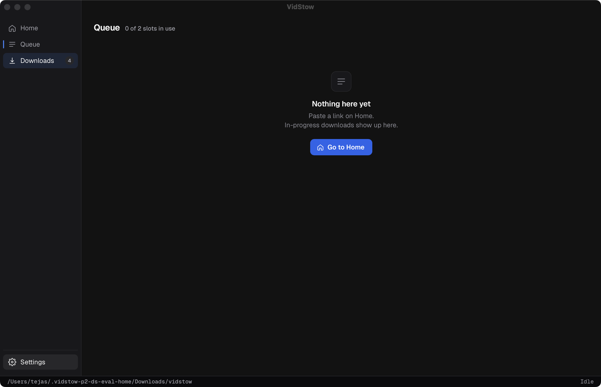
    </td>
    <td width="50%">
      <strong>Playlist review</strong><br>
      Review a playlist, select entries, apply a range, and choose one output policy.<br><br>
      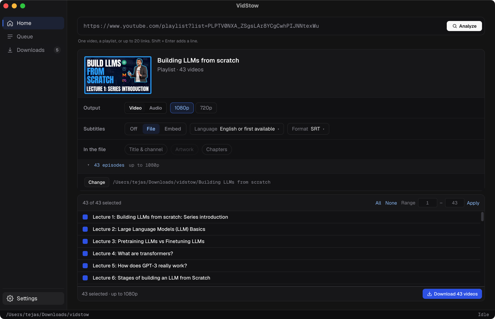
    </td>
  </tr>
  <tr>
    <td width="50%">
      <strong>Download history</strong><br>
      Search completed downloads and open files or reveal them in the system file manager.<br><br>
      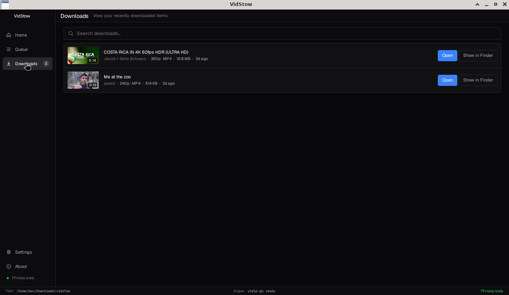
    </td>
    <td width="50%">
      <strong>Settings</strong><br>
      Configure output behavior, queue concurrency, recovery policy, and FFmpeg.<br><br>
      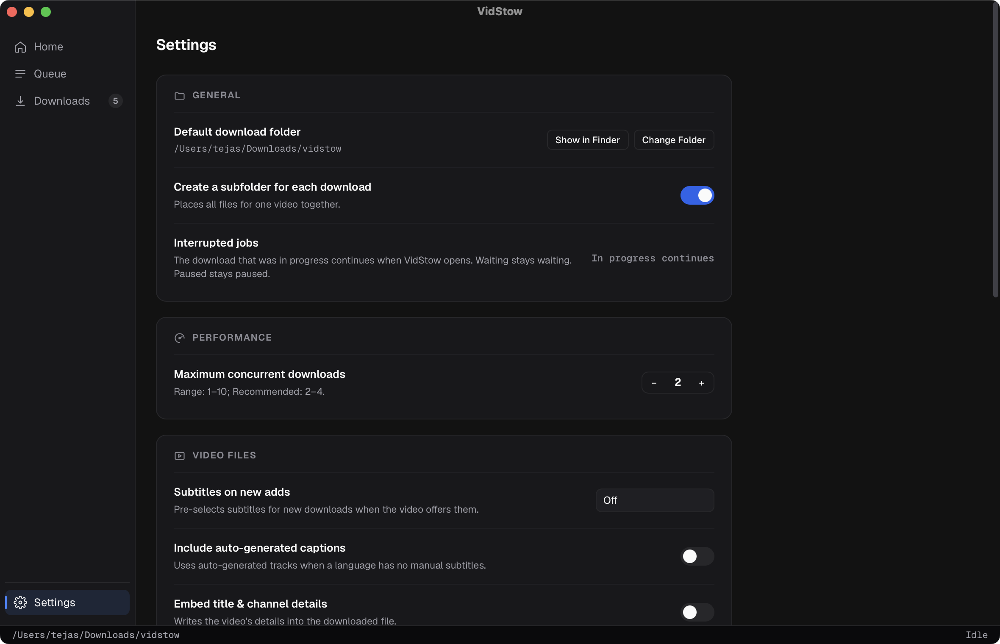
    </td>
  </tr>
  <tr>
    <td colspan="2">
      <strong>Recovery-required state</strong><br>
      Unsafe or unreadable application state disables ordinary queue mutation
      and preserves available recovery evidence for review.<br><br>
      
    </td>
  </tr>
</table>

### Authenticated browser-session UX

These Penpot exports document the implemented consent, review, queue, and
recovery contract. The pull request includes the complete ten-state design
walkthrough, including public default, remediation, and source-forgetting
states.

<table>
  <tr>
    <td width="50%">
      <strong>Explicit setup and consent</strong><br>
      Browser access is optional, no source is selected silently, and the check
      remains disabled until the user authorizes it.<br><br>
      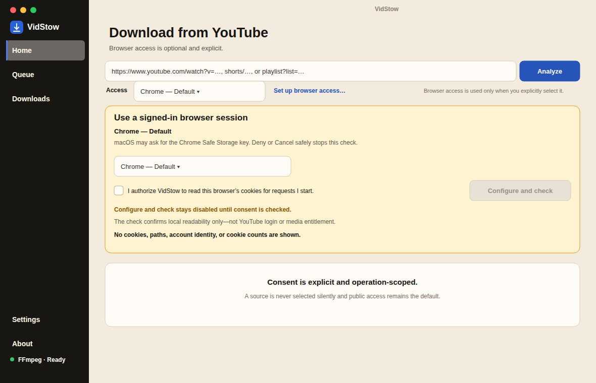
    </td>
    <td width="50%">
      <strong>Single-media review</strong><br>
      The result identifies request mode and exact source without claiming that
      YouTube required or accepted the session.<br><br>
      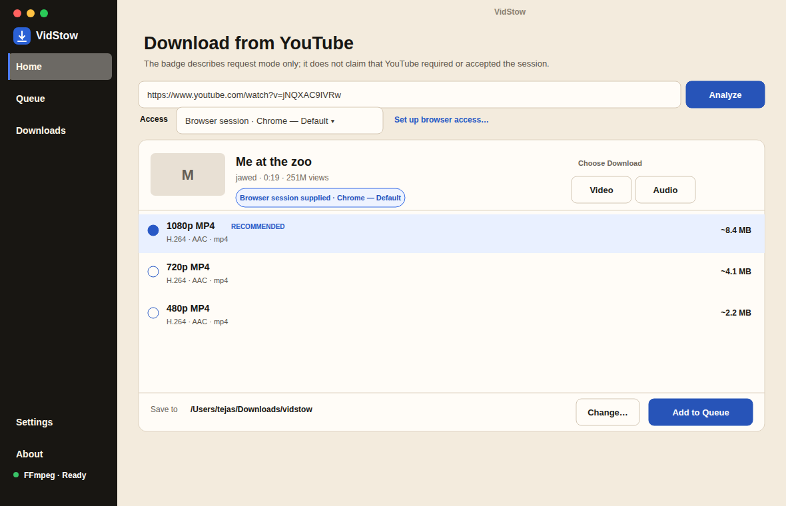
    </td>
  </tr>
  <tr>
    <td width="50%">
      <strong>Deterministic playlist outcomes</strong><br>
      Every exposed occurrence has a visible outcome; selected Ready children
      are admitted in source order.<br><br>
      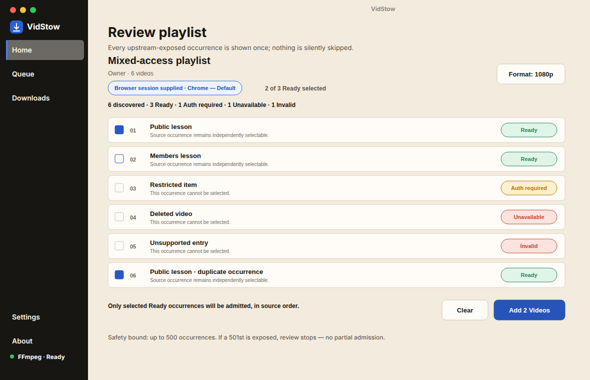
    </td>
    <td width="50%">
      <strong>Bound collection recovery</strong><br>
      Parent counts and the exact browser/profile binding remain visible while
      one child is recovered independently.<br><br>
      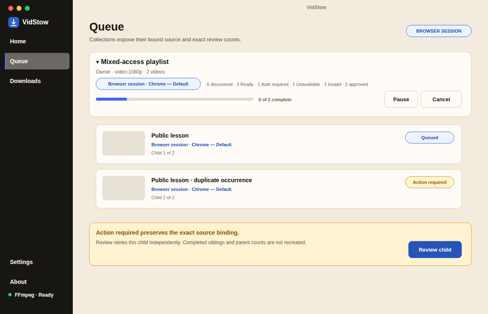
    </td>
  </tr>
  <tr>
    <td width="50%">
      <strong>Browser access settings</strong><br>
      Source discovery, consent, checking, and forgetting are explicit; public
      access remains the Home default.<br><br>
      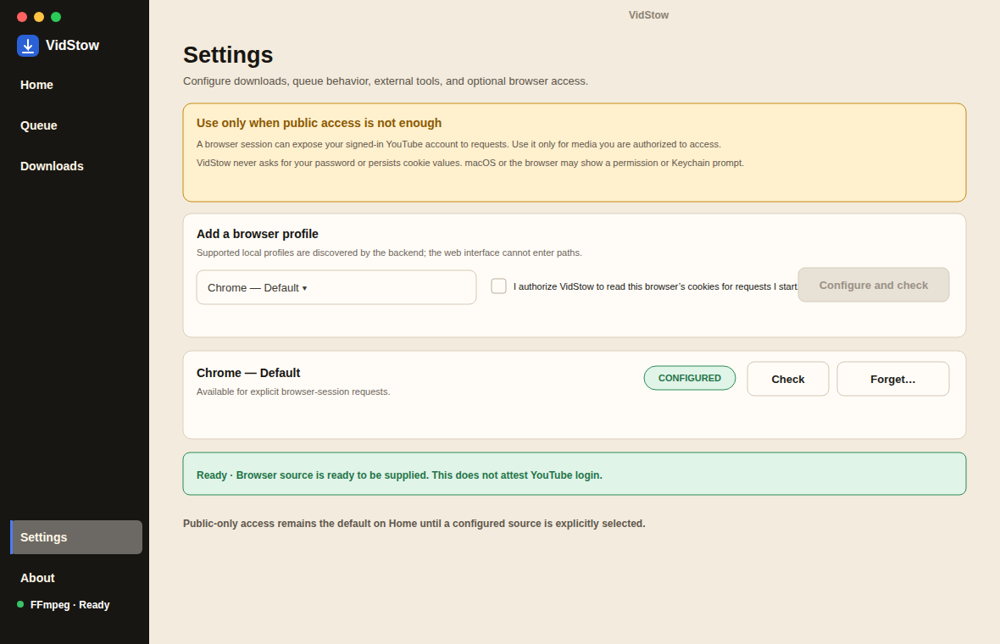
    </td>
    <td width="50%">
      <strong>Action required</strong><br>
      An unusable bound source stops for a decision instead of switching
      profiles or retrying anonymously.<br><br>
      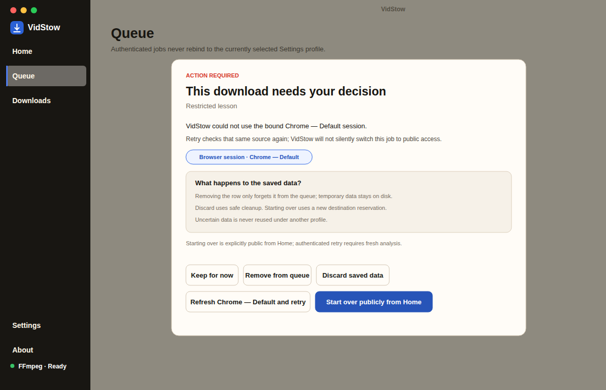
    </td>
  </tr>
</table>

## Project status

VidStow is beta software. Supported behavior is bounded by the exact
application and engine versions and by artifact-specific validation.

| Area | Supported boundary |
| --- | --- |
| Product | Beta; focused YouTube video, Short, existing playlist, and public-only 2–20 URL batch workflow; optional macOS browser-session access |
| Package | [`v0.1.0-beta.5`](https://github.com/vidstow/vidstow/releases/tag/v0.1.0-beta.5) installs on Apple Silicon through the [`vidstow/tap`](https://github.com/vidstow/homebrew-tap) Homebrew cask |
| Source | Apache-2.0 source and self-build instructions |
| Queue | State v2 persistence, revision-checked lifecycle transitions, FIFO admission, and startup reconciliation |
| Engine | [ytdlp-go](https://github.com/tejasa97/ytdlp-go); `go.mod` pins the reviewed hardening commit exposed as `v0.3.1-0.20260823140312-a952b51dca44` |
| Resume | Session reuse is evidence-dependent; no universal transfer continuation or guaranteed byte reuse |
| Updates | Manual downloads from GitHub Releases |

The underlying [`ytdlp-go`](https://github.com/tejasa97/ytdlp-go)
project has broader extractor and CLI capabilities. VidStow supports only the
workflow documented here and exposed by its desktop UI. The Go module path is
`github.com/tejasa97/ytdlp-go`.

## Prerequisites

- [Go 1.25.12](https://go.dev/dl/)
- [Node.js 22](https://nodejs.org/) with npm
- [FFmpeg and FFprobe](https://ffmpeg.org/download.html) on `PATH`, in
  Homebrew's default prefixes (`/opt/homebrew/bin` or `/usr/local/bin`), or a
  user-selected FFmpeg executable with matching FFprobe beside it
- [Wails CLI v2.13.0](https://wails.io/docs/gettingstarted/installation/)

Install the pinned Wails CLI:

```sh
go install github.com/wailsapp/wails/v2/cmd/wails@v2.13.0
```

## Run locally

```sh
git clone https://github.com/vidstow/vidstow.git
cd vidstow

cd frontend
npm ci
cd ..

wails dev
```

## Build the desktop app

```sh
wails build
```

The native artifact is written beneath `build/bin/`. A JavaScript helper used
by the pinned engine is built and verified by the repository's packaging hooks;
it must remain in the location expected by the resulting application bundle or
binary layout.

## How it works

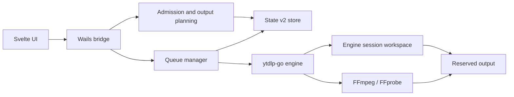

VidStow owns the desktop workflow, queue scheduling, State v2 application
lifecycle, destination reservations, recovery presentation, and UI. The engine
owns extraction, transport, protocol-specific session evidence, media
processing, and output-publication primitives. State v2 and an engine session
manifest are separate authorities; neither substitutes for the other.

The manager produces the queue view and action capabilities consumed by the
frontend. The frontend presents those capabilities rather than inferring
lifecycle authority from status text.

## Local data and privacy

VidStow stores application state in the operating system's per-user
configuration directory. State v2 can include:

- settings, including the selected download folder and an optional FFmpeg path;
- opaque, non-secret descriptors for explicitly configured browser profiles;
- canonical YouTube watch URLs and video IDs;
- display metadata such as title, channel, duration, and selected quality;
- job, attempt, session, queue, lifecycle, reservation, and cleanup records;
- completed-download history, including output paths and media metadata; and
- a separate owner-only diagnostic history, bounded to seven days, 200 typed
  events, and 1 MiB. It contains sanitized failure categories and no YouTube
  URLs, media URLs, arbitrary error text, or absolute paths.

The local diagnostic history itself stays on the device, can be cleared from
Settings, and is included in **Copy Diagnostics** only as a bounded list of
sanitized problem events. Automatic diagnostics remain off unless the user
explicitly selects **Send diagnostics**. When enabled, a separate bounded
outbox sends newly observed, allowlisted terminal-failure reports in the
background; disabling automatic diagnostics deletes anything waiting to be
sent.

Engine session work is stored beneath an engine-owned hidden directory in the
selected output root.

State v2 must not persist media delivery URLs, request headers, cookie values,
credentials, signed query parameters, or media encryption keys. Browser-cookie
access is read-only and operation-scoped; browser-store access is closed and
temporary material is released according to the pinned engine contract. A
queued authenticated job retains only its exact opaque browser/profile binding.
If that source later disappears, the job becomes **Action required** rather than
using another configured profile or falling back to public access. macOS or the
browser may show permission or Keychain prompts during source access.

VidStow does not require a hosted account and does not provide cloud sync.
Normal operation contacts YouTube and its media or thumbnail hosts. If
automatic diagnostics are explicitly enabled, VidStow also contacts
`diagnostics.vidstow.workers.dev` to
submit the bounded reports described above. VidStow may start the locally
installed FFmpeg/FFprobe tools when the selected output requires them.

Errors shown by lifecycle and recovery views are bounded for presentation, but
users should review diagnostic material before sharing it.

## Development

Run the validation suite before submitting a change:

```sh
cd frontend
npm ci
npm run check
npm run test:ui
npm run build
cd ..

go mod tidy -diff
go vet ./...
go test -count=1 ./...
go test -race -count=1 ./...
go build ./...
```

See [Architecture](docs/ARCHITECTURE.md) for ownership and trust boundaries,
and [CONTRIBUTING.md](CONTRIBUTING.md) for project conventions and
dependency boundaries. Generated Wails bindings under `frontend/wailsjs/` are
intentionally not tracked.

## Scope and limitations

VidStow does not support:

- channels, search, library browsing, live streams, or browser-session access
  outside the explicit macOS video, Short, and existing-playlist workflow;
- sites other than YouTube;
- DRM decryption or access-control circumvention;
- universal resumability or byte reuse when media equivalence is unproved;
- treating cleanup, publication, or recovery as successful when evidence is
  uncertain;
- automatic updates or packages outside macOS Apple Silicon; or
- feature parity with yt-dlp or the broader `ytdlp-go` CLI.

## Responsible use

Use VidStow only for content you own or are authorized to download. You are
responsible for following applicable laws, rights-holder permissions, and
platform terms.

VidStow is an independent open-source project. It is not affiliated with,
endorsed by, or sponsored by YouTube, Google, yt-dlp, or any supported service.

## License

Licensed under the [Apache License 2.0](LICENSE). See [NOTICE](NOTICE) for
attribution details.
