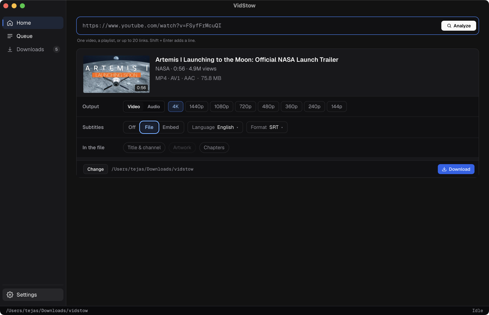

<div align="center">


# VidStow

### Review first. Download exactly what you need.

VidStow is a desktop app for downloading public YouTube videos, Shorts,
playlists, and small batches. Choose the format, subtitles, and file details
before anything enters the queue.

[](https://github.com/vidstow/vidstow/releases/tag/v0.1.0-beta.6)
[](https://github.com/vidstow/vidstow/actions/workflows/ci.yml)
[](LICENSE)

[Install](#install-the-beta) · [Features](#what-vidstow-does) · [Supported downloads](#supported-downloads) · [Privacy](#local-data-and-privacy) · [Build from source](#build-from-source) · [Contributing](CONTRIBUTING.md)



</div>

## What VidStow does

VidStow is a desktop YouTube downloader that lets you choose exactly what you
want before the download begins.

Download videos, audio, playlists, and subtitles through a queue that can
pause, retry, and recover after a restart.

- **Choose the output** — download an available video quality, keep the
  original audio, or convert audio to MP3.
- **Control the file** — save subtitles beside a video or embed them, select
  subtitle languages, and add title, channel, or chapter information.
- **Handle more than one video** — review a playlist or paste 2–20 individual
  video and Short links. VidStow groups them in the queue while keeping each
  download independent.
- **Keep work organized** — pause, resume, retry, or cancel downloads using the
  actions available for their current state. Completed files remain searchable
  in **Downloads**.
- **Recover across restarts** — unfinished queue work is saved. Downloads that
  were active start again when VidStow reopens, while waiting and paused jobs
  keep their previous state.

VidStow deliberately exposes a focused YouTube workflow rather than every
feature supported by its underlying download engine.

## Install the beta

[`v0.1.0-beta.6`](https://github.com/vidstow/vidstow/releases/tag/v0.1.0-beta.6)
is the latest prerelease. The published app currently supports Apple Silicon
Macs and is installed through VidStow's Homebrew tap:

```sh
brew tap vidstow/tap
brew install --cask vidstow
```

The cask installs FFmpeg and FFprobe as dependencies. Upgrade later with:

```sh
brew update
brew upgrade --cask vidstow
```

> [!WARNING]
> The current app is ad-hoc signed and is not notarized by Apple. The Homebrew
> cask verifies the release archive against its pinned SHA-256 checksum, then
> removes macOS quarantine so VidStow can launch. Review the
> [tap](https://github.com/vidstow/homebrew-tap), source, and release metadata
> before installing.

VidStow is designed for macOS, Linux, and Windows, but Windows, Linux, and Intel
Mac packages are not published yet. Those platforms currently require a source
build.

## Supported downloads

| Input | Current support |
| --- | --- |
| Public YouTube video or Short | Analyze and download individually |
| YouTube playlist | Review and select from up to 500 listed entries |
| Pasted batch | Review 2–20 individual public video or Short URLs together |
| Video link that also names a playlist | Choose the single video or the full playlist |
| Channels, search, and live streams | Not supported |
| Private, signed-in, or cookie-based downloads | Not supported |
| Sites other than YouTube | Not supported by the VidStow app |

Available qualities and containers depend on the video. Playlist downloads use
a shared video or audio policy, while each video still receives an output that
is valid for that title.

### Subtitles and file details

For video downloads, VidStow can save a subtitle file beside the video or embed
captions in the downloaded file. Individual videos expose the subtitle tracks
reported during analysis; playlists and batches use a preferred language with a
documented fallback when that language is unavailable.

Subtitle conversion, embedded captions, MP3 conversion, title and channel
metadata, and chapter markers may require FFmpeg. Thumbnail artwork embedding
is visible in the interface but is temporarily unavailable.


## Queue and downloads

Single videos, playlists, and pasted batches all enter the same durable queue.
Collections appear as expandable parents, but their children remain independent:
one failed video does not discard the successful downloads beside it.

VidStow runs two downloads at a time by default. Settings can raise the limit to
ten, although higher concurrency can make YouTube rate-limit requests. Queue
rows show progress and only the actions that are currently available, including
pause, resume, retry, cancel, open, and remove.

Completed files appear in **Downloads**, where they can be searched, opened,
revealed in the operating system's file manager, removed from history, or
deleted from disk.


Pause and retry are evidence-based. VidStow reuses saved work when the engine
can validate it, but it does not promise that every resumed or retried download
will reuse bytes already on disk. See [Architecture](docs/ARCHITECTURE.md) for
the recovery and ownership boundaries.

## Local data and privacy

VidStow does not require an account and does not provide cloud sync. Its
settings, queue, recovery records, and completed-download history are stored in
the operating system's per-user configuration directory. Engine session work
is stored in a hidden directory beneath the selected download folder.

VidStow does not persist cookies, credentials, request headers, signed media
URLs, or media encryption keys. Normal downloads contact YouTube and its media
or thumbnail hosts, and VidStow may start the locally installed FFmpeg and
FFprobe tools when an output requires them.

Local diagnostic history contains bounded, sanitized failure categories rather
than YouTube URLs, arbitrary errors, or absolute paths. Automatic diagnostic
sending is off until the user explicitly enables it. When enabled, only newly
observed, allowlisted terminal-failure reports are sent to
`diagnostics.vidstow.workers.dev`; disabling it deletes reports waiting to be
sent. The complete rules are documented in the
[diagnostics contract](docs/diagnostics/CONTRACT_V1.md).

Review copied diagnostic material before sharing it.

## Build from source

Source builds require:

- [Go 1.25.12](https://go.dev/dl/)
- [Node.js 22](https://nodejs.org/) with npm
- [Wails CLI v2.13.0](https://wails.io/docs/gettingstarted/installation/) and
  the native dependencies required by Wails on your operating system
- [FFmpeg and FFprobe](https://ffmpeg.org/download.html) for most video plans,
  MP3 conversion, subtitles, and embedded file details

Install the pinned Wails CLI, clone the repository, and start the development
build:

```sh
go install github.com/wailsapp/wails/v2/cmd/wails@v2.13.0

git clone https://github.com/vidstow/vidstow.git
cd vidstow

cd frontend
npm ci
cd ..

wails dev
```

Run `wails build` to create a native application under `build/bin/`. The build
hooks compile and place the JavaScript helper required by the pinned engine.

VidStow uses Go and Wails for the desktop application, Svelte for the interface,
[`ytdlp-go`](https://github.com/tejasa97/ytdlp-go) for extraction and transfer,
and FFmpeg for merging and conversion. The exact engine version is pinned in
[`go.mod`](go.mod).

Read [Architecture](docs/ARCHITECTURE.md) for the application boundaries,
[Release packaging](docs/RELEASE.md) for artifact verification, and
[Contributing](CONTRIBUTING.md) for the validation suite and project
conventions.

## Responsible use

Use VidStow only for content you own or are authorized to download. You are
responsible for following applicable laws, rights-holder permissions, and
platform terms.

VidStow is an independent open-source project. It is not affiliated with,
endorsed by, or sponsored by YouTube, Google, yt-dlp, or any supported service.

## License

Licensed under the [Apache License 2.0](LICENSE). See [NOTICE](NOTICE) for
attribution details.
