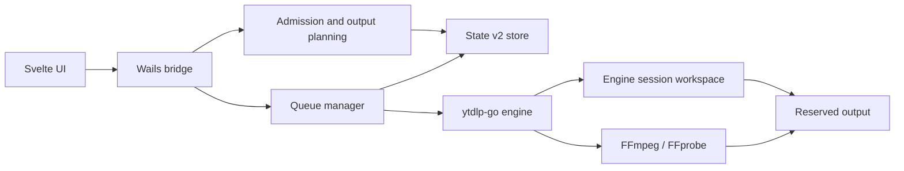

# VidStow architecture

This document describes the current application architecture. It is not a
roadmap and does not describe unimplemented features.

## System boundary

VidStow owns the desktop workflow, queue scheduling, durable application state,
destination reservations, lifecycle commands, recovery presentation, and UI.
The `ytdlp-go` engine owns extraction, transfer, protocol-specific resume
validation, engine session workspaces, media processing, and output
publication primitives.

VidStow imports the provider-neutral engine and the focused YouTube provider.
Engine capabilities that are not exposed by the VidStow UI are not VidStow
features.

## Queue authority

One manager owns the in-process FIFO queue. The configured download concurrency
is bounded from 1 through 10 and defaults to 2. The manager fills available
slots in FIFO order. A worker retains its slot through transitional and media
processing activity until its runner settles.

The backend produces the complete `QueueView` consumed by the frontend. The
view includes lifecycle, phase, desired state, occupancy, queue position,
persistence health, and explicit action capabilities. The frontend does not
infer lifecycle authority from presentation text.

## Identity

A durable row separates three identities:

- **Job ID** identifies the logical queue and history record.
- **Attempt ID** identifies one execution attempt and rejects stale events.
- **Session ID** identifies one engine-owned resumable workspace.

Transport URLs, cookies, request headers, and other expiring credentials are
not durable media identity.

## Durable lifecycle

State v2 records durable lifecycle values independently from presentation
phase and live scheduler occupancy.

Durable lifecycle values are:

- pending;
- active;
- pausing;
- paused;
- canceling;
- failed;
- canceled;
- completed; and
- action-required.

Presentation phases are preparing, downloading, waiting for processing,
finalizing, ready to publish, publishing, and cleaning up. Occupancy is a live
manager fact and is not restored from disk as proof that a worker exists.

High-frequency progress, speed, and ETA updates do not establish durable
lifecycle authority.

## Admission and destination ownership

Admission resolves a server-owned output plan, validates an owner-controlled
output root, selects bounded destination basenames, and commits the job and its
reservation together in State v2. The manager accepts the resulting admitted
contract rather than recalculating filenames independently.

Reservations prevent VidStow jobs from claiming the same destination. Engine
publication uses the reserved target and must not silently overwrite an
unrelated file.

## State v2

State v2 is a bounded, versioned document stored in the operating system's user
configuration area. Transactions operate on a cloned state image under process
and cross-process locks, then atomically replace the document.

The store distinguishes a failed operation known not to have committed from an
indeterminate replacement outcome. An indeterminate outcome is not retried as
though absence were proven.

Corrupt, unsupported, unsafe, or indeterminate state is preserved for
recovery. Such evidence does not authorize destructive queue or session
mutation.

## Startup and shutdown

Startup opens and validates State v2 before restoring queue rows. An unreadable
or untrusted queue is quarantined; settings are salvaged when possible, and the
workstation starts healthy with a dismissible notice. An unwritable or unsafe
data folder, including a remapped recovery-required or instance-lock outcome, is
a cannot-save stop and does not create the runtime. Recovery otherwise
reconciles durable application records with engine session and publication
evidence. Restored scheduler occupancy is always false until the current
process starts a worker.

Ordinary quit leaves in-progress jobs durable as they are, the same as a crash.
Pause-and-quit stops admission, records pause intent for active durable work,
signals manager-owned runners, and waits within a caller-provided bound.
Evidence that did not settle safely remains recoverable rather than being
reported as a successful pause.

## Trust boundaries

- Raw filesystem and engine errors may contain private paths or transport data;
  user-facing diagnostics receive bounded, presentation-safe messages.
- State and engine manifests have separate authority. State owns application
  lifecycle; engine manifests own resumable media evidence.
- Missing, malformed, unsafe, contended, unavailable, or indeterminate evidence
  does not prove that reuse or cleanup is safe.
- The application does not import engine `internal` packages.

## Current protocol boundary

VidStow's durable desktop session boundary covers direct HTTP media,
separate-track processing, finite HLS VOD, and static DASH when the selected
engine release provides the required validation. Live workflows and
experimental SABR/UMP behavior are outside the current VidStow product scope.
